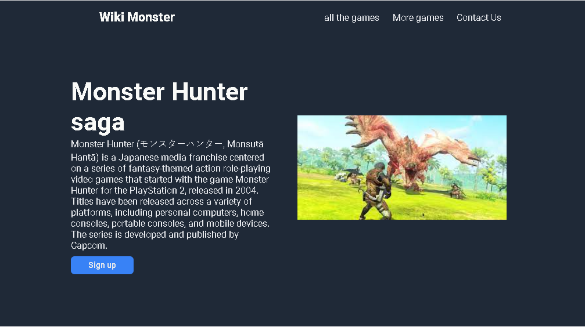

# Project Name

> One paragraph statement about the project.

Additional description about the project and its features.

## Built With

- Major languages
- Frameworks
- Technologies used

## Live Demo

[Live Demo Link](https://eltorretaz.github.io/Tarea_8sep23_html-css/)

## Getting Started

**This is an example of how you may give instructions on setting up your project locally.**
**Modify this file to match your project, remove sections that don't apply. For example: delete the testing section if the currect project doesn't require testing.**

To get a local copy up and running follow these simple example steps.

### Prerequisites

### Setup

### Install

### Usage

### Run tests

### Deployment

## Authors

👤 **Armando Enrique Torres Caceres**

- GitHub: [@Eltorretaz](https://github.com/Eltorretaz)
- Twitter: [@Armando35558384](https://twitter.com/Armando35558384)

## 🤝 Contributing

Contributions, issues, and feature requests are welcome!

Feel free to check the [issues page](https://github.com/Eltorretaz/Tarea_8sep23_html-css/issues).

## Show your support

Give a ⭐️ if you like this project!

## Acknowledgments

- Hat tip to anyone whose code was used
- Inspiration
- etc

## 📝 License

This project is [CC0 1.0 Universal](LICENSE) licensed.